<!-- Profile Header -->

  

  
  
  

<!-- Typing Intro -->

  

---

<!-- Profile Introduction -->
<!-- 

  👋 I'm <b>Cao Nguyễn Tuấn Anh</b> — an IT student passionate about Software & Game Development. 
  🎓 Studied at <b>University of Science – Viet Nam National University, Ho Chi Minh City</b> 
  📊 GPA: <b>3.49 / 4.00</b>

 -->

<!-- GitHub Stats & Activity -->
<!-- 

  <picture>
    <source srcset="https://github-readme-stats.vercel.app/api?username=tac101a&show_icons=true&theme=radical&include_all_commits=true&rank_icon=github&cache_seconds=48800" media="(prefers-color-scheme: dark)"/>
    
  </picture>

  <picture>
    <source srcset="https://github-readme-stats.vercel.app/api/top-langs/?username=tac101a&layout=compact&langs_count=8&theme=radical&cache_seconds=28800" media="(prefers-color-scheme: dark)"/>
    
  </picture>

 -->

  

<!-- 

  <picture>
    <source srcset="https://streak-stats.demolab.com?user=tac101a&theme=radical&hide_border=true" media="(prefers-color-scheme: dark)"/>
    
  </picture>

  <picture>
    <source srcset="https://streak-stats.demolab.com?user=tac101a&theme=radical&cache_seconds=48800" media="(prefers-color-scheme: dark)"/>
    
  </picture>

 -->

---

<!-- Snake animation -->

  <picture>
    <source media="(prefers-color-scheme: dark)" srcset="https://raw.githubusercontent.com/tac101a/tac101a/output/github-contribution-grid-snake-dark.svg">
    <source media="(prefers-color-scheme: light)" srcset="https://raw.githubusercontent.com/tac101a/tac101a/output/github-contribution-grid-snake.svg">
    
  </picture>

  
  &nbsp;
  

